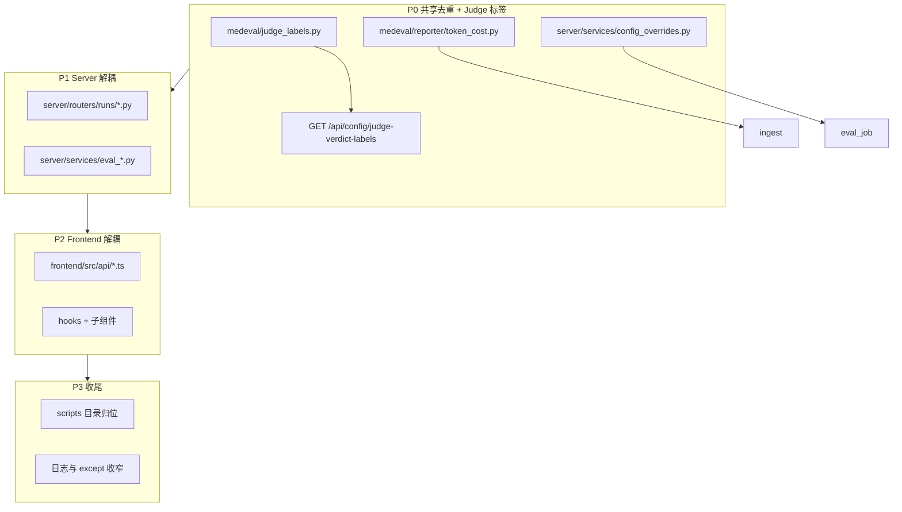

# 重构分层与解耦 — 设计说明

> **历史设计快照**（2026-06-15 批准）。后端/前端分层已按 OpenSpec 变更落地并归档；**现状以 `openspec/specs/`、`server/README.md`、`.cursor/rules/frontend-workflow.mdc` 为准**，本文保留动机与阶段划分供追溯。索引见 [`README.md`](../README.md)。

> 日期：2026-06-15  
> 状态：已批准（用户确认 P0→P3 范围 + Judge 中文标签前后端对齐）  
> 约束：**零行为变更** · 不改对外 API 路径/字段 · 不改数据格式 · 不新增框架 · 不升级核心依赖

---

## 1. 背景与动机

上一轮现状分析指出：`server/routers/runs.py`（~992 行）、`eval_job.py`、`frontend/api.ts` 与大页面存在职责堆叠；`ingest` 与 `reporter` 重复 token/cost 计算；Judge 展示标签在 `frontend/caseJudging.ts`、`server/compare.py`、`server/routers/config.py`（profile）多处维护且口径不一致（如 `triage_quality` / `multi_turn_consistency` 前端缺失）。

本次重构仅在**现有技术栈内**做结构优化，为后续功能迭代降低回归成本。

---

## 2. 目标与非目标

### 2.1 目标

| # | 目标 | 验收 |
|---|------|------|
| G1 | 规范目录分层，巨型文件按职责拆分 | 单文件 <300 行（聚合入口除外） |
| G2 | 平台层与内核边界清晰，消除重复逻辑 | token/cost、config override 单一信任源 |
| G3 | Judge verdict 中文标签前后端对齐 | `GET /api/config/judge-verdict-labels` + 前端消费 |
| G4 | 基础容错：关键路径日志带业务 id，保留既有降级语义 | 不改 HTTP 状态码与 JSON 字段 |
| G5 | 全量回归绿 | `pytest` + `medeval run --dry-run` |

### 2.2 非目标

- 不改判分算法、HardGate 启发式、scoring profile 权重与 pass_rule 语义
- 不引入 Celery/RQ、async SQLAlchemy、OpenAPI codegen
- 不改 REST 路径、请求/响应 schema、CLI 子命令
- 不改 `report.json` / `detail_json` / DB 列含义
- 不处理 `graphify-out/` gitignore（可另开 change）
- 不合并 `import_feishu` 未完成功能（与 refactor 分支隔离）

---

## 3. 分阶段架构



---

## 4. P0：共享去重与 Judge 标签（详细设计）

### 4.1 Judge verdict 标签单一信任源

**问题**：三处映射漂移

| 位置 | 粒度 | 示例 |
|------|------|------|
| `frontend/utils/caseJudging.ts` | `prefix.suffix` | `硬门槛·红旗分诊`；缺 `triage_quality` 等 |
| `server/compare.py` `_JUDGE_LABELS` | judge 指纹 key | `硬门槛 HardGate`（含英文） |
| 无后端 API | verdict 全名 | — |

**方案**：

1. 新增 `medeval/judge_labels.py`：
   - `FINGERPRINT_LABELS: dict[str, str]` — 对应 `RunReport.judge_fingerprints` 的 key（供 `compare.py` 使用）
   - `VERDICT_PREFIX_LABELS` / `VERDICT_SUFFIX_LABELS` — 与现前端语义对齐，**补全**用例库已出现的 rubric 维度：
     - `triage_quality` → `分诊建议`
     - `multi_turn_consistency` → `多轮一致性`
     - `differential_thinking` → `鉴别思维`
     - `inquiry_completeness` → `问诊完整性`
     - `output_check` → `输出检查`（`rule.output_check0` 等）
     - `point` / `summary`（scoring_point 动态后缀回退规则与现前端一致）
   - `def judge_verdict_label(name: str) -> str` — 纯函数，无 IO

2. 新增只读 API（**兼容扩展**，不改变既有端点）：
   ```
   GET /api/config/judge-verdict-labels
   → { "hard_gate.red_flag": "硬门槛·红旗分诊", ... }
   ```
   实现：遍历 `VERDICT_PREFIX × VERDICT_SUFFIX` 预置表 + 动态 pattern 说明写入 docstring；响应用于前端缓存，**未知 verdict 仍回退 raw name**（与现行为一致）。

3. 前端：
   - 新增 `useJudgeVerdictLabels()`（镜像 `failureTags.ts` 模块级缓存）
   - `judgeLabel(name)` 改为读缓存；挂载前回退 `name`（SSR/首屏与现行为一致）
   - **展示字符串对已知 key 与现前端一致**；仅补全此前缺失维度的中文（纯展示改进，不计分）

4. `server/compare.py` 改为 `from medeval.judge_labels import FINGERPRINT_LABELS`

5. 测试：
   - `tests/test_judge_labels.py`：快照已知 verdict 名 → 标签
   - `tests/server/test_config_judge_labels.py`：API 200 + 包含 `llm.triage_quality`
   - 现有 `caseJudging.test.ts` 若有则更新；无则新增轻量单测

### 4.2 Token / 成本计算去重

- 从 `medeval/reporter/aggregator.py` 抽出 `token_cost.py`：
  - `case_token_totals(cr: CaseResult) -> tuple[int|None, ...]`
  - `case_token_cost(cr, pricing) -> tuple[int|None, float|None]`
- `aggregator._token_summary` 与 `server/ingest._case_token_cost` **均调用**上述函数
- 新增 `tests/test_token_cost.py`：characterization — 与 refactor 前 ingest 输出 bitwise 一致

### 4.3 配置覆盖抽取

- 新建 `server/services/config_overrides.py`：
  - `apply_judge_overrides(config, judge_dict)`
  - `apply_adapter_overrides(config, adapter_dict)`（从 eval_job 迁出）
- `eval_job.py` 保留同名 re-export（`tests/server` monkeypatch 兼容）
- 测试：迁现有 `test_rejudge_overrides` 覆盖路径，行为不变

---

## 5. P1：Server 解耦

### 5.1 拆分 `server/routers/runs.py`

```
server/routers/runs/
  __init__.py      # APIRouter 聚合，prefix 仍为 /api/runs（在 app 注册处不变）
  _helpers.py      # _get_run_or_404, _filtered_case_rows, _case_scores ...
  crud.py          # create, list, get, delete, rename, pin, progress
  rejudge.py       # rejudge, resume, preview_rejudge_case
  review.py        # review-queue, annotate, annotations, review-stats
  cases.py         # list_case_results, get_case_detail, cases-yaml, export
  diff.py          # diff_run（若独立则放此，或留 crud）
```

- `server/app.py` 注册方式：`from .routers.runs import router`（`__init__.py` 导出合并 router）
- **所有路径、方法、响应模型不变**

### 5.2 拆分 `server/eval_job.py`

```
server/services/
  config_overrides.py   # P0
  eval_launch.py        # 发起评测主流程
  eval_rejudge.py       # judge_traces 路径
  eval_resume.py        # resume 路径
  eval_artifacts.py     # write_core_artifacts, retention, diff resolve 包装
```

- `eval_job.py` 变薄：re-export `run_eval_job`, `run_rejudge_job`, ... 供 `jobs.py` / tests patch

---

## 6. P2：Frontend 解耦

### 6.1 拆分 `api.ts`

```
frontend/src/api/
  client.ts       # http 封装（从 api.ts 抽出）
  runs.ts
  benchmarks.ts
  pairwise.ts
  config.ts
  auth.ts
  index.ts        # 聚合为 export const api = { ... }（与现 import 兼容）
```

- `frontend/src/api.ts` 改为 `export * from './api/index'` 或保留 re-export 一层，**零调用方改动**（可选逐步迁移 import 路径）

### 6.2 大页面组件化

- `RunDashboardPage` → `hooks/useRunDashboard.ts` + 已有 card 组件
- `PairwiseDetailPage` → `hooks/usePairwiseDetail.ts` + modal/table 子组件
- 不改路由、不改 API 调用序列

---

## 7. P3：收尾

- `calibration/compute_agreement.py` → `scripts/compute_agreement.py`（根目录 README/MIGRATION 补一行路径）
- `.aidp_proxy.py` → `scripts/aidp_proxy.py`（README 更新引用）
- `eval_job` / `langfuse_tracing`：裸 `except Exception` 补 `logger.exception(..., extra={run_id})`，**不**改变 no-op 降级
- 文档：在 `AGENTS.md` 增补「aggregator 命名对照」一小节

---

## 8. 风险与缓解

| 风险 | 缓解 |
|------|------|
| 行为漂移 | P0 characterization tests；每阶段全量 pytest |
| 循环导入 | 共享逻辑只放 `medeval/`；`server` 单向依赖 |
| Router 路径破坏 | `tests/server/test_api.py` + 各 runs 子路由复制原 path |
| Monkeypatch 断裂 | `eval_job` / `runs` 保留模块级 re-export |
| Judge 标签「算改 UI」 | 仅补全缺失维度中文；已知 key 字符串与现前端对齐；API 为 additive |
| OpenSpec 范围膨胀 | 单一 change `refactor-layering-debt`；与 feishu import 分支分离 |

---

## 9. 治理衔接

编码前 MUST：

1. `graphify update .`
2. 创建 `openspec/changes/refactor-layering-debt/`（proposal + tasks + delta spec 声明「结构重组、SHALL 保持行为等价」）
3. 按阶段 PR / 合并，每阶段归档前 `openspec validate --strict`

---

## 10. 批准记录

- 用户确认：P0→P1→P2→P3 范围；Judge 中文标签前后端对齐（2026-06-15）
